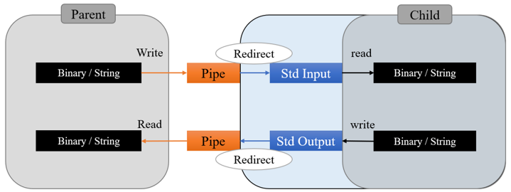

# SubProcess

  

2プロセス間の通信を親子関係で結んだものです。  
親プロセスは子プロセスを起動し，単純なストリームとして扱うことができます。本リポジトリのサンプルではC++/C#を親プロセス，Pythonを子プロセスとしました。  
データはローカルホスト内であればパイプ通信によって運ばれるためとても高速です。mmapのようにディスク領域を使うこともありません。  
また，子プロセスの標準入出力を親プロセスとのパイプ通信にリダイレクトするようにしたので，子プロセス側は単純なコマンドラインアプリで十分です。外部にインターフェースを提供するような設計は必要ありません。  
例外処理など細かいミスはあるかと思いますが，そのあたりは大目にみてください。  

It is a parent-child relationship for communication between two processes.  
The parent process can invoke the child process and treat it as a simple stream. In the sample in this repository, C++/C# is used as the parent process and Python as the child process.  
Data is carried by pipe communication within the local host, which is very fast and does not use disk space as mmap does.  
Also, since the standard I/O of the child process is redirected to the pipe communication with the parent process, a simple command line application is sufficient for the child process. There is no need to design an interface to the outside world.  
There may be some minor errors such as exception handling, but please forgive them.  
